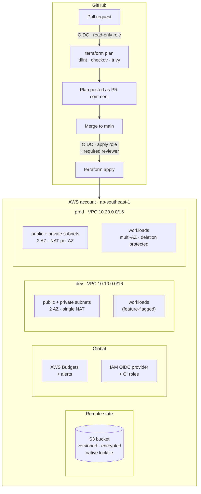

# AWS Infrastructure as Code — Terraform

[](https://github.com/sahrudindev/terraform-aws-platform/actions/workflows/terraform-plan.yml)
[](https://github.com/sahrudindev/terraform-aws-platform/actions/workflows/security.yml)
[](.terraform-version)
[](environments/dev/versions.tf)
[](LICENSE)

Production-shaped AWS infrastructure managed entirely as code. Two isolated
environments, reusable modules, remote state with native S3 locking, and a CI
pipeline that authenticates to AWS through OIDC federation — no long-lived
access keys anywhere in the repository or in GitHub secrets.

> 🇮🇩 A detailed walkthrough in Bahasa Indonesia, explaining every component and
> how to build the same thing by hand in the AWS Console, lives in
> [`docs/BELAJAR.md`](docs/BELAJAR.md).

---

## Architecture



Each environment composes the same modules with different sizing:

| Module | What it provisions |
|---|---|
| `networking` | VPC, public/private subnets across 2 AZs, IGW, NAT, route tables |
| `web-app` | Application Load Balancer + ECS Fargate service in private subnets |
| `database` | RDS PostgreSQL, private, master password managed by Secrets Manager |
| `serverless` | Lambda + API Gateway HTTP API, source zipped at apply time |
| `eks` | EKS control plane + managed node group |
| `data-lake` | Layered S3 buckets + Glue Data Catalog + Athena workgroup |

---

## Quickstart

Requires [Terraform 1.16.0](.terraform-version) (`use_lockfile` needs ≥ 1.10) and AWS CLI v2.

```bash
# 1. Create the state backend and move its own state into it.
#    Also writes backend.hcl for every other stack.
make bootstrap

# 2. Cost guardrails and CI federation.
cd global
cp terraform.tfvars.example terraform.tfvars   # set alert_emails + github_*
terraform init -backend-config=backend.hcl
terraform apply

# 3. Build the dev foundation.
cd ../environments/dev
cp terraform.tfvars.example terraform.tfvars
terraform init -backend-config=backend.hcl
terraform apply
```

After step 1 no Terraform state remains on your machine - the bootstrap stack
stores its own state in the bucket it created. See
[ADR-0005](docs/adr/0005-bootstrapping-the-state-backend.md) for why, and for
the alternatives that were weighed.

Workloads are **off by default**. Enable them one at a time in
`terraform.tfvars` and re-run `plan` before `apply`:

```hcl
enable_nat_gateway = true   # required before anything runs in private subnets
enable_web_app     = true
enable_database    = true
```

---

## CI/CD

| Workflow | Trigger | What it does |
|---|---|---|
| [`terraform-plan.yml`](.github/workflows/terraform-plan.yml) | pull request | `fmt` → `validate` → `tflint` → `plan` for dev and prod, posted as a PR comment; optional Infracost diff |
| [`terraform-apply.yml`](.github/workflows/terraform-apply.yml) | push to `main`, manual dispatch | `apply`, gated behind a GitHub Environment with a required reviewer |
| [`security.yml`](.github/workflows/security.yml) | pull request, push, weekly | checkov, trivy and gitleaks, results uploaded as SARIF to the Security tab |

Authentication uses `sts:AssumeRoleWithWebIdentity`. Two roles with different
blast radius:

- **plan role** — `ReadOnlyAccess` plus state bucket access; assumable from any
  ref in this repository
- **apply role** — `PowerUserAccess` plus a narrowly scoped IAM policy;
  assumable only from `refs/heads/main` and the protected environments

Deliberately *not* `AdministratorAccess` — see
[`docs/adr/0002-ci-iam-permissions.md`](docs/adr/0002-ci-iam-permissions.md).

Repository variables to set once (`Settings → Secrets and variables → Actions → Variables`):

| Variable | Value |
|---|---|
| `AWS_STATE_BUCKET` | output `state_bucket` from `bootstrap` |
| `AWS_PLAN_ROLE_ARN` | output `github_actions_plan_role_arn` from `global` |
| `AWS_APPLY_ROLE_ARN` | output `github_actions_apply_role_arn` from `global` |

---

## Cost

Most of this stack is free or near-free when idle. These are the ones that are not:

| Resource | Cost when idle | Guard |
|---|---|---|
| NAT Gateway | ~$32/month each | `enable_nat_gateway = false` by default; dev shares one NAT |
| EKS control plane | ~$73/month | `enable_eks = false` by default |
| RDS instance | varies by class | `enable_database = false` by default; `db.t4g.micro` in dev |
| ALB | ~$16/month | `enable_web_app = false` by default |
| S3, DynamoDB, Lambda, API Gateway | cents | — |

An AWS Budget with alerts at 80% actual and 100% forecast is created by the
`global` stack before any workload exists.

Disabling GitHub Actions does not stop any of this billing — Actions only drives
the changes. To stop the spend, remove the resources: see
[`docs/TEARDOWN.md`](docs/TEARDOWN.md). `make unplug` revokes CI's access to AWS
without touching infrastructure; `make destroy` removes everything in the order
that works.

---

## Local development

```bash
pre-commit install          # fmt, validate, tflint, terraform-docs, gitleaks
terraform fmt -recursive
tflint --init && tflint --recursive
checkov -d . --config-file .checkov.yaml --compact
```

Conventions:

- `terraform plan` before every `apply`. Never change a managed resource in the Console.
- `.terraform.lock.hcl` **is committed** — CI and every developer resolve identical provider builds.
- `terraform.tfvars` and `backend.hcl` are gitignored; their `*.example` counterparts are not.
- Commits follow [Conventional Commits](https://www.conventionalcommits.org/).

---

## Repository layout

```
bootstrap/              S3 state bucket — run once, state stays local
global/                 account-wide: budgets, GitHub OIDC provider, CI roles
modules/                reusable building blocks
environments/dev/       small, cheap, destroyable
environments/prod/      multi-AZ, deletion protected
docs/                   roadmap, learning guide, ADRs, scan reports
.github/workflows/      plan, apply, security
```

## Documentation

| Document | |
|---|---|
| [`docs/TEARDOWN.md`](docs/TEARDOWN.md) | How to remove all of this, what keeps billing, and what refuses to be deleted |
| [`docs/ARCHITECTURE.md`](docs/ARCHITECTURE.md) | Request flow, state layout, environment topology, blast radius |
| [`docs/SETUP-AWS-ACCESS.md`](docs/SETUP-AWS-ACCESS.md) | Getting AWS credentials onto a workstation |
| [`docs/SECURITY.md`](docs/SECURITY.md) | Scanning, baseline findings, accepted risks |
| [`docs/ROADMAP.md`](docs/ROADMAP.md) | Audit findings and the phased plan for this repository |
| [`docs/BELAJAR.md`](docs/BELAJAR.md) | 🇮🇩 Component-by-component walkthrough, Terraform vs Console |
| [`docs/adr/`](docs/adr/) | Architecture Decision Records |
| [`docs/reports/`](docs/reports/) | Security scan baselines |

## License

[MIT](LICENSE)
