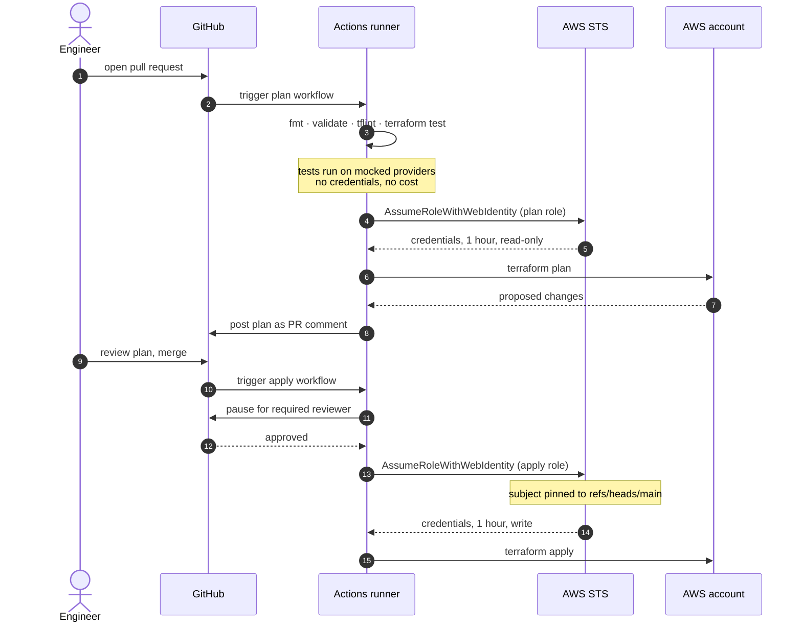
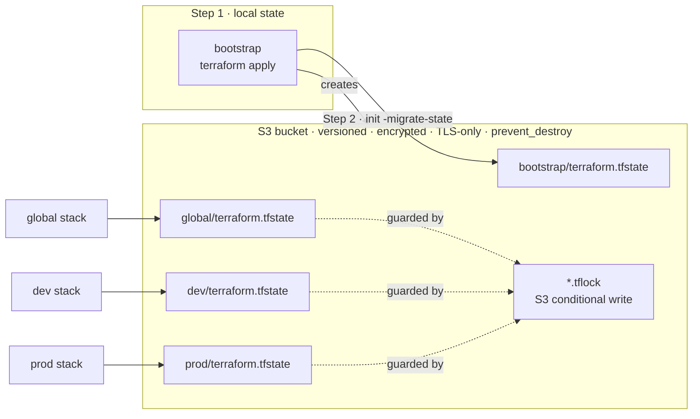
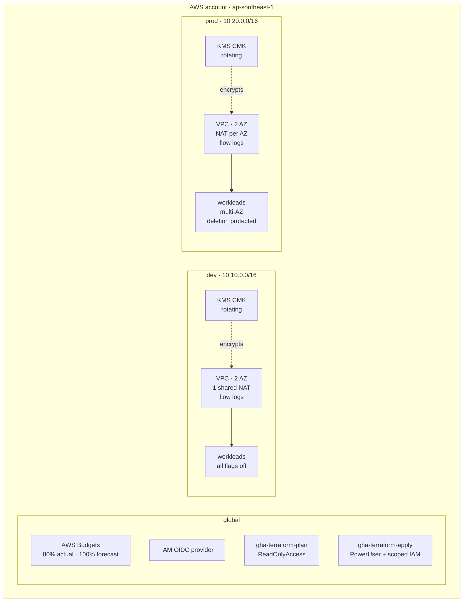
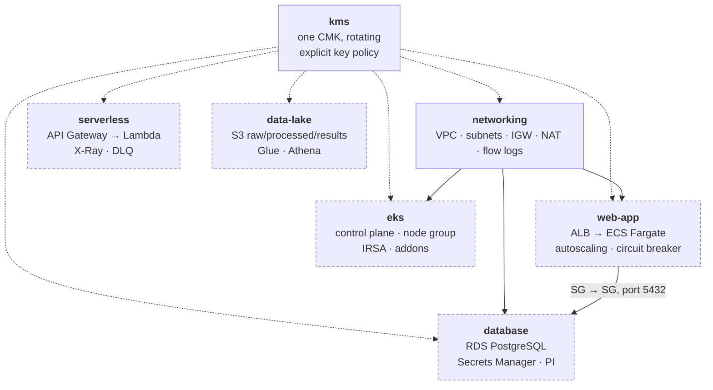

# Architecture

## How a change reaches AWS

Nothing is applied from a laptop. A change is a pull request, and the only
path to production runs through review, automated checks, and a human approval.

No long-lived AWS access key exists anywhere in this flow.

## State

The bootstrap stack stores its own state in the bucket it created. After step 2
no Terraform state remains on any workstation. Locking uses S3 conditional
writes rather than a DynamoDB table — see
[ADR-0003](adr/0003-s3-native-state-locking.md) and
[ADR-0005](adr/0005-bootstrapping-the-state-backend.md).

## Environment topology

`dev` and `prod` are the same modules with different arguments. They share no
state, no VPC, and no CIDR range.

## Inside an environment

Every workload is behind a feature flag and off by default, because the
expensive resources here bill whether or not anyone uses them.

Dashed borders are flag-controlled. `networking` and `kms` are always on.

## Blast radius

What can reach what, and what stops it.

| Boundary | Enforced by |
|---|---|
| Pull request cannot write to AWS | Plan role holds `ReadOnlyAccess`; trust policy grants write only to `refs/heads/main` |
| CI cannot escalate its own privileges | Apply role has no `iam:CreateUser`, no `iam:AttachUserPolicy`; `iam:PassRole` is constrained by `iam:PassedToService` |
| `dev` cannot damage `prod` | Separate state keys, separate VPCs, non-overlapping CIDRs |
| `prod` cannot be applied unsafely | Lifecycle preconditions reject prod without deletion protection, a final snapshot, and 7-day backups |
| A stray `destroy` cannot remove the state bucket | `prevent_destroy` on the bucket |
| The database cannot be reached from the internet | Private subnets, `publicly_accessible = false`, ingress only from a named security group |
| The VPC default security group cannot be used as a bypass | Emptied of all rules by `aws_default_security_group` |
| State cannot be read over plaintext HTTP | Bucket policy denies `aws:SecureTransport = false` |
